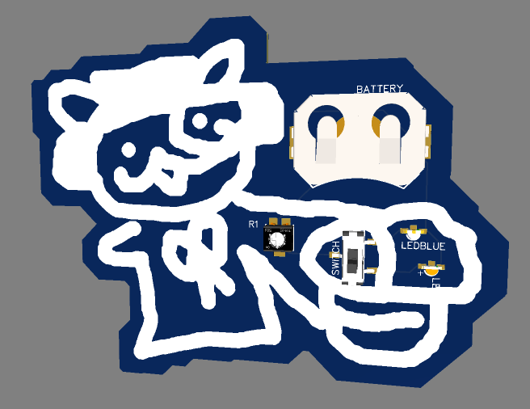
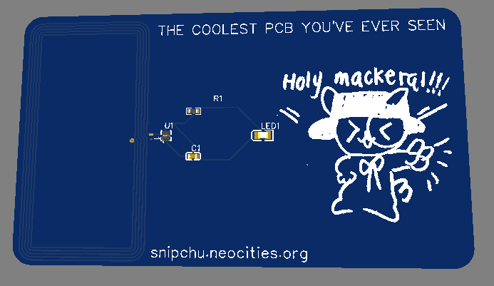
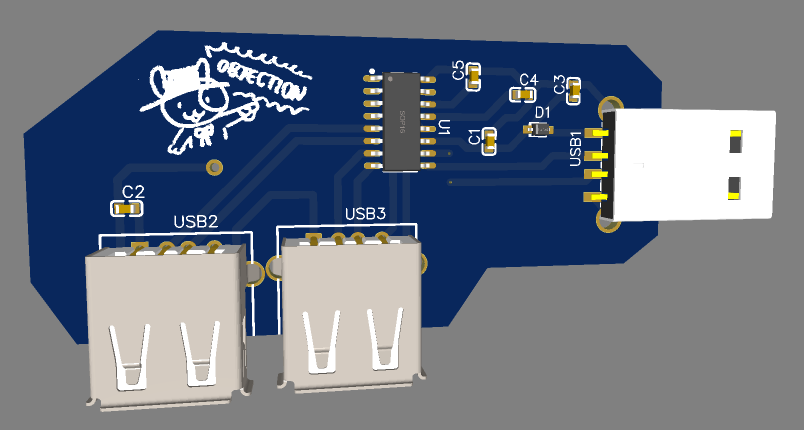

# pcbs
learning how to make pcbs and stuff using easyeda
most of this is just following hackclub tutorials

* flashinglights: bunnyguy shooting at your with a lazer beam - hackclub electronic trash tutorials

* hackercard: following hackclub hacker card tutorial

* usbhub: following hackclub usbhub turorial

(open the json file in easyeda to access each pcb)
